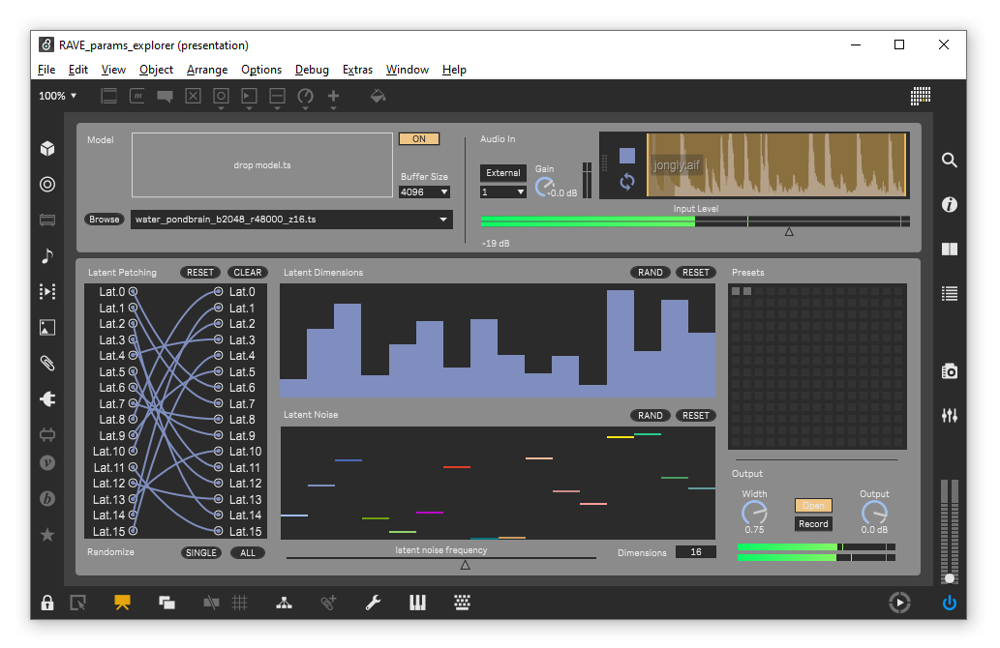

# RAVE Latent Parameters Explorer

This device encourages the exploration of RAVE models' latent parameters by manually dialing in or randomizing the connexions between the encoder and decoder, the value of each latent dimension and their modulation amount. It is based on the Acids Lab's work (RAVE and nn~), and is essentially a redesign of the [VST version](https://forum.ircam.fr/projects/detail/rave-vst/) with a quicker acces to and simpler visual representation of the latent connexions and parameters.

# Installation

1. Download the latest `nn~` version [here](https://github.com/domkirke/nn_tilde/releases/), extract and place it in your Max Packages folder.
2. **FOR WINDOWS ONLY**: as instructed on the `nn~` [web page](https://forum.ircam.fr/projects/detail/nn/), copy and paste the `.dll` files from the package next to the `Max.exe` (usually `C:\Program Files\Cycling '74\Max 8`).
3. Download pre-trained RAVE models from the [Acids Lab](https://acids-ircam.github.io/rave_models_download) or [Intelligent Instruments Labs](https://huggingface.co/Intelligent-Instruments-Lab/rave-models) and place them in a designated folder. If you already have a RAVE models folder, make sure that the path is added to `File Preferences` in Max. This is needed for the dynamic loading of models. Note that the patche's `Browse` button lets you choose a custom location to replace the path of the drop down menu.

# Usage

**After creating a file path to the RAVE models folder, an easy test to make sure they are properly seen by Max is to open a new patcher and load a `nn~` object with a model name (ex. `isis.ts`) and a method (`forward`, `encode`, `decode`) as arguments. If the path and the `.dll` files (Windows) are properly seen, the object will load normally without any error messages. If any error messages appear in the Max console, either the file path or the `.dll` files are misplaced.**

- Before the first open of the `RAVE_params_explorer.maxproj` file, open `Audio Status` and select the desired inputs and an outputs. This will assure the proper loading of the patch and prevent any issues related to audio settings. **FOR WINDOWS ONLY**: since the device will load up four instances of the models in two mcs.nn~ objects, it is recommanded to set the audio settings to `ad_mme`, the `Thread Priority` to **Highest** and `Latency (ms)` to 250. Other set-ups seem to occur CPU spikes (Windows 10, ThinkPad T14 Gen5 AMD Ryzen 8840u, 32Gb RAM) and major audio drops.
  
- On startup, the first model in the drop down menu will be loaded and heard. Note that, technically, there is no need to change the file path of the drop down menu; if the RAVE models folder is seen by Max and the same models are present in your models folder, they will be loaded correctly in the `nn~` objects. But, to assure that everything is the same, it is better to change the path to your own folder. Alternatively, the `drop model.ts` box enables dragging and dropping any RAVE `model.ts` file manually.
  
- The `buffer size` is set by default to 4096 since this device was not built with real-time purposes in mind. The latency will increase or decrease depending on the `buffer size` along with the CPU usage.
