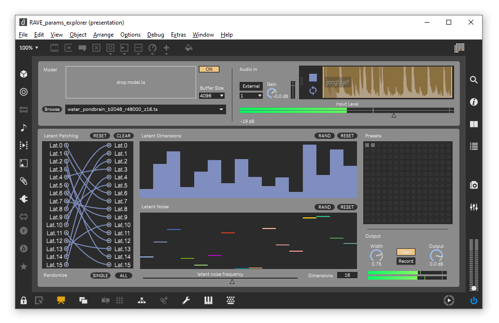

# RAVE Latent Parameters Explorer

This device encourages the exploration of RAVE models' latent parameters by manually dialing in or randomizing the connexions between the encoder and decoder, the values of each latent dimensions and their modulation amount.

# Installation

1. Download the latest `nn~` version [here](https://github.com/domkirke/nn_tilde/releases/), extract and place it in your Max Packages folder.
2. **FOR WINDOWS ONLY**, as instructed on the `nn~` [web page](https://forum.ircam.fr/projects/detail/nn/), copy and paste the `.dll` files from the package next to the `Max.exe` (usually `C:\Program Files\Cycling '74\Max 8`).
3. Download pre-trained RAVE models from the [Acids Lab](https://acids-ircam.github.io/rave_models_download) or [Intelligent Instruments Labs](https://huggingface.co/Intelligent-Instruments-Lab/rave-models) and place them in a designated folder. If you already have a RAVE models folder, make sure the path is added to `File Preferences` in Max. This is needed for the dynamic loading of models. Note that the *Browse* button lets you choose a custom location to replace the path of the drop down menu.

# Usage
